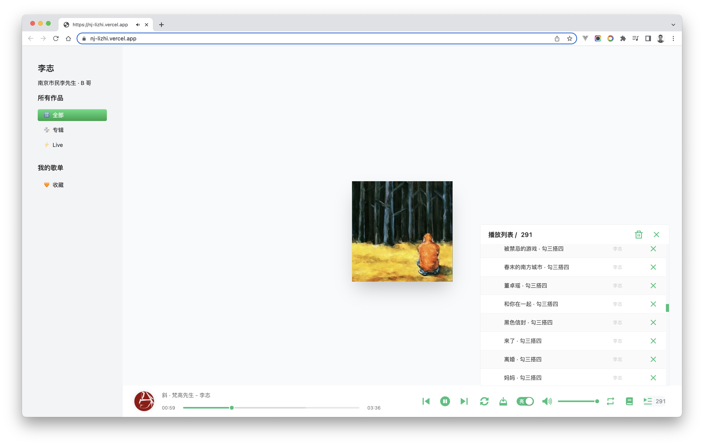

<h1 align="center">李志 · BB</h1>

<p align="center">开箱即用，一个珍藏了李志音乐作品集的在线播放器</p>

<div align="center">
  <a href="https://lizhi.turkyden.com" target="_blank">：：：✨ Live Demo ✨ ：：：</a>
</div>

<br/>



## 🌏 永久托管

所有资源托管于 Github 仓库, 使用 [jsdelivr](https://www.jsdelivr.com/) CDN 全球加速，你可以这样下载一首歌：

```
https://gcore.jsdelivr.net/gh/nj-lizhi/song@master/audio/${专辑名称}/${歌名}.mp3
```

歌单索引 [list.js](https://gcore.jsdelivr.net/gh/nj-lizhi/song@master/audio/list.js)，会前端开发的小伙伴可以基于曲库资源 DIY 你自己的播放器 ！

```js
[{
  name: "阿兰",
  artist: "专辑-108个关键词",
  url: "https://gcore.jsdelivr.net/gh/nj-lizhi/song@master/audio/108个关键词/阿兰.mp3",
  cover: "https://gcore.jsdelivr.net/gh/nj-lizhi/song@master/audio/108个关键词/cover.png",
},
{
  name: "忽然",
  artist: "专辑-108个关键词",
  url: "https://gcore.jsdelivr.net/gh/nj-lizhi/song@master/audio/108个关键词/忽然.mp3",
  cover: "https://gcore.jsdelivr.net/gh/nj-lizhi/song@master/audio/108个关键词/cover.png",
}]
```

## 📹 Live 现场

- 2009-我爱南京跨年演唱会
- 2014-IO跨年演唱会
- 2015-看见北京站直播实录
- 2018-洗心革面跨年演唱会

## 💿 作品专辑

| :zap: **LIVE**           | 💿 **专辑**           |
| :------------------------: | :------------------------: |
| 108 个关键词             | 8                        |
| io                       | 1701                     |
| 北京不插电               | 被禁忌的游戏             |
| 动静                     | 梵高先生                 |
| 二零零九年十月十六日事件 | 你好，郑州               |
| 工体东路没有人           | 我爱南京                 |
| 勾三搭四                 | F                        |
| 家                       | 这个世界会好吗           |
| 看见                     | 在每一条伤心的应天大街上 |
| 我们也爱南京             |                          |
| 广场                     |                          |
| 零碎                     |                          |

## 参与贡献

Installed the dependencies of project.

```bash
npm install
```

Run the app with npm script.

```bash
npm run start
```

## TODO

准备申请域名 [www.李志.com](www.李志.com)

- [x] 电脑网页端
- [ ] 移动端 H5
- [ ] 评论区

## 跨平台

车载系统中使用，例如特斯拉 Model 3

https://user-images.githubusercontent.com/24560160/187013816-6630dff6-7ab2-447d-9287-61ac876bc807.mp4

## 参考链接

若有一天这个网站挂了，不用的担心，还有很多朋友做了播放器，可以去他们那里听听啦 ~

- https://www.lizhi334.com/
- https://github.com/GoldSubmarine/lizhi

## 支持者

感谢大家对该项目的支持，感谢 [GoldSubmarine](https://github.com/GoldSubmarine) 发起的的音乐资源库 [nj-lizhi](https://github.com/nj-lizhi)

[](https://github.com/turkyden/lizhi/stargazers)

## 版权声明

版权全部归于李志先生所有，本人仅从互联网搜集资源进行合并整理。从李志公众号发布的声明来看，他也希望会得到传播，所以我个人贸然建立了此 Repository，并已发送邮件告知李志先生。若邮件回复不允许，我会立即删除。

[MIT](./LICENSE) & Copyright © 1998 - 2022 LiZhi. All Rights Reserveds.
